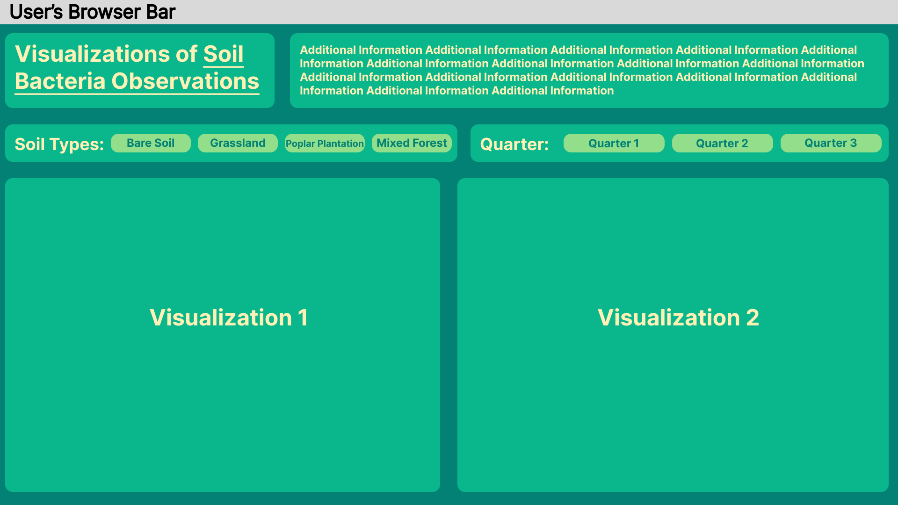

# Visualizations of Soil Bacteria Observations
By: Abby and Jacob Matos

# Running Locally
Download the git repository as a zip and unpack it. 
Open the folder of the project and run the index.html file with Live Server (https://marketplace.visualstudio.com/items?itemName=ritwickdey.LiveServer0).

# The Description
Explain how to read the visualization (what each axis and encoding meting means), explain the idioms separately.

# The Framework

